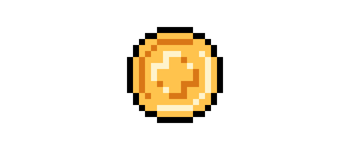
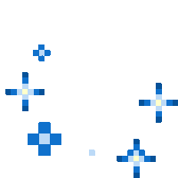

Hello World!  
**`My name is Bao`**
===========================================================================================================================

**I’m a `Computer Science` student at `George Mason University`** building at the intersection of **`AI`**, **`full-stack systems`**, and **`cloud infrastructure`**. I like **moving fast**, **shipping real products**, and **learning whatever I need** to turn ideas into working software.

## Life
- 🎓 **`Computer Science`** at [**George Mason University**](https://www.gmu.edu/)
- 🤖 **`AI System and Automation Intern`** @ **Hemut (YC X25)**
- 🚀 **`AI Software Intern`** @ **Deepiri**
- 🧠 **`AI Extern`** @ **Extern**
- 🌐 **`Google for Developers Program`** @ **Google**
- 🏦 **`Software Engineer Intern`** @ **Astrion Bank**
- ☁️ **`Software Engineer Intern`** @ **CloudyScale.ai**
- ⚡ **`Cloud Developer`** @ **PatriotHacks**

## Highlights
- 🏅 **`Dean’s List`** ×3
- 🤖 Built **`AI`** and **`full-stack`** products using **`LLMs`**, **`multi-agent systems`**, **`RAG workflows`**, and **`cloud tools`**
- 💻 Strong interest in **`Software Engineering`**, **`AI Engineering`**, **`Cloud`**, and **`Machine Learning`**
- 📚 Always learning through **projects**, **technical interviews**, and **new technologies**

# 💻 **`Tech Stack`**:

  
  
  
  
  
  
  
  
  
  
  
  
  
  
  
  
  
  
  
  
  
  
  
  
  
  
  
  
  
  
  
  
  
  
  
  
  
  
  
  
  
  
  
  
  
  
  
  
  
  
  
  
  
  
  
  
  
  
  
  
  
  
  
  
  
  
  
  
  

 

# 📊 GitHub Stats:
 

  
  &nbsp;&nbsp;

 

# 💬 Let's Connect

   
   
   

